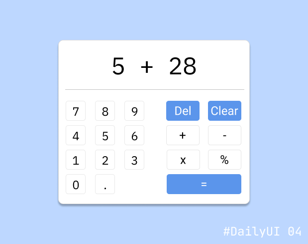
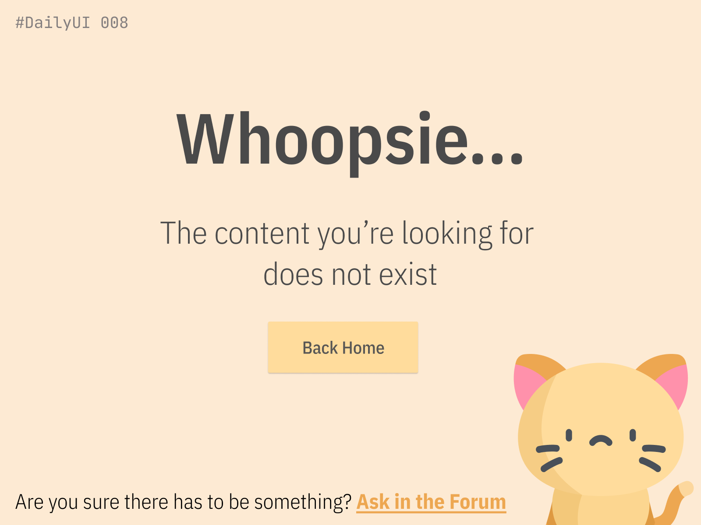
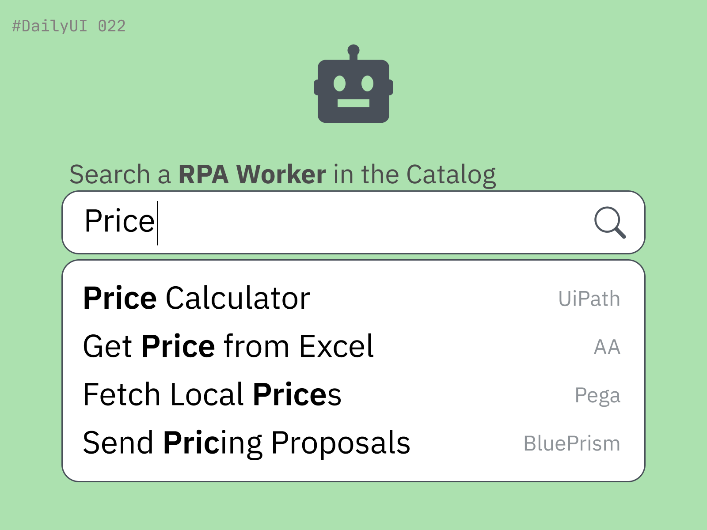

# 100daysofdesign

[DailyUI](https://www.dailyui.co/) Challenge - Deliverables

*Also published on [Dribbble](https://dribbble.com/niklaskiefer)*

## Challenge 004 - Calculator

Design a calculator. Standard, scientific, or specialty calculator for something such as a mortgage? Is it for a phone, a tablet, a web app?

## Challenge 008 - 404 Not Found

Design a 404 page. Does it suit the brand's style? Is it user-friendly? It might sound mundane, but not everything can be flash or glamorous. Every day millions of people will be landing on 404 pages. You have an opportunity to help them in a way that's useful and aesthetically pleasing. (It's up to you!)

## Challenge 022 - Search Bar

Design something search related. It could be a search bar, an advanced search window, a search function, etc. 

## License

[MIT](./License)
